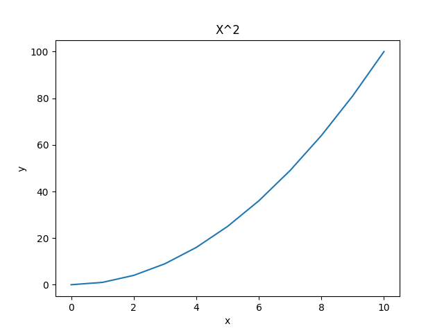

#+TITLE: Blog post test
#+AUTHOR: Florent Collin

#+SUBTITLE: Florent Collin - April 2021
#+OPTIONS: html-style:nil num:nil ^:nil
#+OPTIONS: toc:2 num:nil html-postamble:nil html-style:nil ^:nil
* First Chapter
*Lorem ipsum dolor* sit amet, consectetur adipiscing elit. Mauris blandit *orci* =libero=, ut /rutrum/ metus dictum id. Duis suscipit magna sed nisl malesuada, sed fermentum ante posuere. Aliquam quis feugiat massa. Aenean fermentum massa ligula, in sagittis ante ultricies sit amet. Quisque fringilla eu purus a placerat. Sed gravida orci semper, iaculis nunc non, vehicula tellus. Morbi in ornare lacus.

** First section

Quisque cursus lacinia orci id feugiat. Ut porttitor nisl sapien, sed accumsan dolor accumsan vel. Phasellus dapibus ante quis leo tempus lobortis. Phasellus tincidunt purus mi, a dictum ante vulputate eu. In ultrices aliquam tincidunt. Mauris vehicula interdum odio, non convallis lorem porttitor vitae. Curabitur enim urna, sagittis non dapibus at, hendrerit id urna. Cras maximus justo eu lorem tincidunt, nec placerat velit auctor. Donec sed blandit felis.

#+CAPTION: Testing a Godot Engine demo
[[video:chapter1/test-video.mp4]]

Duis cursus urna justo, eget tempor urna volutpat at. Maecenas a vulputate sem. Nunc commodo id quam vitae convallis. Aenean id faucibus ante. Vivamus ac mi et tortor aliquet dapibus nec nec sapien. Suspendisse cursus tortor sed urna finibus, et placerat eros pellentesque. Donec dapibus fermentum ipsum sit amet ornare. Sed porttitor risus quis tortor volutpat imperdiet. Curabitur id nulla odio. Fusce quis enim viverra, tincidunt tellus quis, hendrerit arcu. Curabitur id sollicitudin dui. Duis ornare condimentum neque. Vestibulum porttitor placerat blandit. Morbi eget pharetra arcu.

** Code example
#+begin_src python :results file :exports both
import numpy as np
import matplotlib.pyplot as plt
import seaborn as sns
plt.figure()
xs = list(range(11))
ys = [x**2 for x in xs]

ax = sns.lineplot(x=xs, y=ys)
ax.set_title("X^2")
ax.set_xlabel("x")
ax.set_ylabel("y")

filename = "chapter1/line.png"
plt.savefig(filename)
plt.close()

return filename
#+end_src

#+RESULTS:

#+CAPTION: Square function plotted between 0 and 10

*** Subsection ?
Integer hendrerit, odio vel blandit viverra, ante dui pretium magna, in aliquet nunc urna ut magna. Sed eleifend imperdiet turpis quis scelerisque. Nulla varius condimentum pulvinar. Aliquam molestie vitae ex at consectetur. Fusce tempus ac nibh id ornare. Integer auctor bibendum fringilla. Nunc malesuada justo sit amet scelerisque viverra. Aenean sagittis ullamcorper magna, sit amet dictum velit finibus ornare. Nunc sollicitudin, libero ac pellentesque elementum, eros arcu congue nunc, sit amet ullamcorper dolor lacus id turpis. Maecenas ac consequat lectus, sed facilisis felis.

*  Second chapter
This is a quote.
#+begin_quote
It is easier to act yourself into a new way of thinking, than it is to think yourself into a new way of acting. - Millard Fuller
#+end_quote

And we can include tables
#+NAME: table:sf-parameters
#+CAPTION: Valeurs des paramètres pour les 3 SFs
#+attr_latex: :align |l|r|
|---------------------------+--------|
| *Paramètre*                 | *Valeur* |
|---------------------------+--------|
| MSF_MAX_NUMCELLS          |    100 |
| MSF_LIM_NUMCELLSUSED_HIGH |   0.75 |
| MSF_LIM_NUMCELLSUSED_LOW  |   0.25 |
|---------------------------+--------|
| OTF_THRESHOLD             |      4 |
| OTF_HOUSEKEEPING_PERIOD   |    1.0 |
| OTF_TRAFFIC_SMOOTHING     |    0.4 |
|---------------------------+--------|
| EOTF_THRESHOLD            |      4 |
| EOTF_HOUSEKEEPING_PERIOD  |    1.0 |
| EOTF_TRAFFIC_SMOOTHING    |    0.4 |
| B (bonus de congestion)   |      4 |
| \alpha                    |   0.20 |
| \beta                     |   0.80 |
|---------------------------+--------|

#+CAPTION: We can also include gif

And reference other blog post entries [[file:chapter2.org][Other blog post entry]]
#+HTML: 