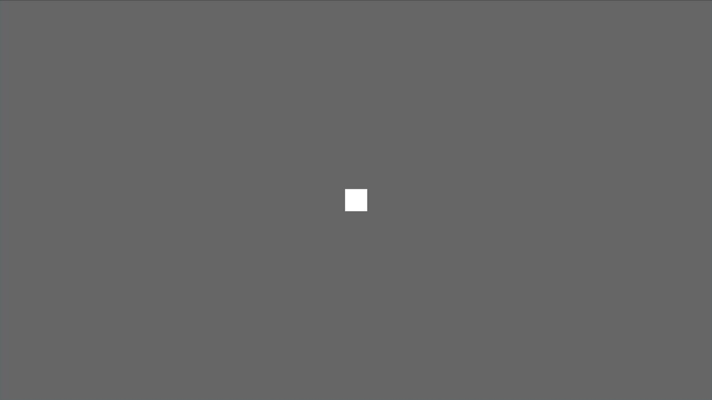
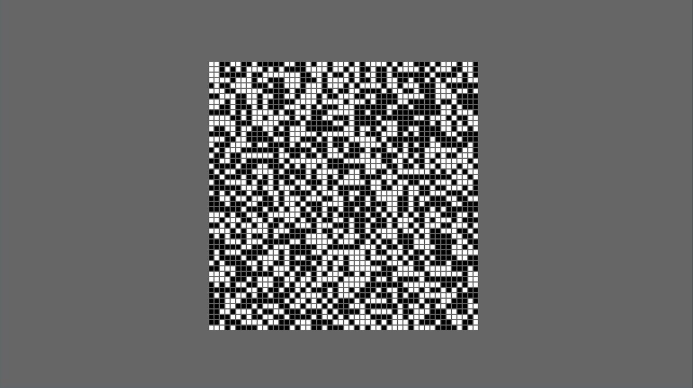

As you might already know, Bevy is a relatively new game engine written in Rust using a Data Driven approach. This blog post is an introduction to Bevy showing how to build a Cave Generator based on a cellular automaton. Even if you are not familiar with cellular automata, you probably already have heard about the Game of Life of John Conway.

All the code used in this tutorial is available on [GitHub](https://github.com/FlorentCollin/cave-generation-bevy/), feel free to clone and play with it.

# What we are going to build

Like said in the introduction, we are going to build a simple cave generator based on the principle of cellular automata. Particularly we are going to use a simple 2D grid to represent the cave. Each part of the grid, is named a cell. A cell can be in one of the following two states: *Alive* or *Dead*. An alive cell is colored in white whereas a dead cell is colored in black. The following image shows the 2D grid composed of cells where their states were randomly generated.


# New bevy project
Before starting to implement the generator, we must add the following dependencies to our project. In this tutorial we use Bevy 0.6 (which is the latest version at the time this blog is written).
```toml
# In Cargo.toml
[dependencies]
bevy = "0.6.0"
rand = "0.8.4"
```
# Drawing our first window
The first thing each Bevy project does is to create an App and a window in which we will render the cave. The following block of code does just that.

```rust
use bevy::prelude::*;

fn main() {
    App::new()
        .add_plugins(DefaultPlugins)
        .run();
}
```

The ``add_plugins(DefaultPlugins)`` insert a bunch of plugins that handle windows, inputs, assets, and so on. A plugin in Bevy is just a bundle adding systems to the App. As we will se in the next section, we can code our own plugins to bundle some functionalities.

# Let's draw a square
An empty window is not so useful to look at, so let's draw a square in the middle which will serve as the basis to draw the grid of cells later on. 

The grid is composed of cells that we represent by a white square if the cell is alive and by a black square otherwise.
In order not to obfuscate the main function, we create a new Plugin named ``CaveGeneratorPlugin``. This plugin will contain all the necessary code to initialize our cave generator. 

```rust
fn main() {
    App::new()
        .add_plugins(DefaultPlugins)
        .add_plugin(CaveGeneratorPlugin) // <--- new
        .run();
}

struct CaveGeneratorPlugin;

impl Plugin for CaveGeneratorPlugin {
    fn build(&self, app: &mut App) {
        // Note: spawn_cell and setup_camera are defined in the next code block
        app.add_startup_system(spawn_cell)
            .add_startup_system(setup_camera);
    }
}
```
This creates a new plugin that we can add in the main function. This plugin add two startup system. A *startup system* is a function run only once when the application is launched. In contrary, Bevy has also the notion of *systems* which are functions run each frame. These systems contains the core logic of our application and will allow us to update the state of our cells.
The startup systems ``spawn_cell`` and ``setup_camera`` are just simple functions.

```rust
fn setup_camera(mut commands: Commands) {
    // Spawning a camera is necessary to view the square
    commands.spawn_bundle(OrthographicCameraBundle::new_2d());
}

fn spawn_cell(mut commands: Commands) {
    commands.spawn_bundle(SpriteBundle {
        sprite: Sprite {
            color: Color::WHITE,
            ..Default::default()
        },
        transform: Transform {
            scale: Vec3::new(40.0, 40.0, 1.0),
            ..Default::default()
        },
        ..Default::default()
    });
}
```
These two functions take as an argument a ``Commands`` which enables us to spawn entities and bundle (which themselves are a bunch of entities). Entities are the base of the Bevy Entity Component System. The ``SpriteBundle`` spawn a white square of size 40.0x40.0. The ``z`` component of the vector is set to 1.0 but it could have be set to any value since it doesn't matter in 2D.



# Introducing the cell's state and modifying the sprite color
Spawning a single square in the middle of the window is already a great start but it doesn't have any state associated with it. As a reminder, a cell can be either alive or dead. Therefore each square must have a state associated with it and must be able to change the state of each cell separately.

To implement the cell state we create a new ``Component`` named ``CellState`` containing the state of a cell. Moreover the *Default* trait is also implemented and allow us to generate a new cell with a random state easily.
```rust
use rand::random;

impl Plugin for CaveGeneratorPlugin {
    fn build(&self, app: &mut App) {
        app.add_startup_system(spawn_cell) // <--- new
            .add_startup_system(setup_camera);
    }
}

#[derive(Component)]
struct CellState {
    alive: bool,
}

impl Default for CellState {
    fn default() -> Self {
        CellState {
            alive: random::<bool>(), // The `rand` crate should be added to the dependencies
        }
    }
}
```

Now that we have the code to generate a new cell's state we can associate it with the square by simply inserting it. From now on, a ``CellState`` is linked to our single square.
```rust
fn spawn_cell(mut commands: Commands) {
    commands
        .spawn_bundle(SpriteBundle {
            sprite: Sprite {
                color: Color::WHITE,
                ..Default::default()
            },
            transform: Transform {
                scale: Vec3::new(40.0, 40.0, 40.0),
                ..Default::default()
            },
            ..Default::default()
        })
        .insert(CellState::default()); // <--- new
}

```

As said earlier, we want to display a cell in white if the cell is alive and in black otherwise. As Bevy use a ECS, it means that we can query the entities and do some manipulations with them. To change the color of a cell, we introduce a system named ``change_colors`` which is executed at each frame.
```rust
impl Plugin for CaveGeneratorPlugin {
    fn build(&self, app: &mut App) {
        app.add_startup_system(spawn_cell)
            .add_startup_system(setup_camera)
            .add_system(change_colors); // <--- new
    }
}

//                               this query is for entities
//                               with a Sprite and CellState     Filter for the query to only run on modified
//                             ↓ components.                   ↓ entities with a CellState component
fn change_colors(mut q: Query<(&mut Sprite, &CellState), Changed<CellState>>) {
    //                              |       |
    //       +----------------------+       |
    //       |       +----------------------+ 
    //       v       v
    for (mut sprite, cell_state) in q.iter_mut() {
        sprite.color = if cell_state.alive {
            Color::WHITE
        } else {
            Color::BLACK
        }
    }
}
```

At first this function might be a bit overwhelming. So, let's break it down.

The system ``change_colors`` is a simple function taking a single argument ``q`` which is of type ``Query``. A query in Bevy allows us to request some entities to the ECS. Here, we query the ECS and ask for all ``Sprite`` that also have a ``CellState`` component associated with them. On those entities, we only want the ``CellState`` that have changed. Therefore, a changed ``CellState`` is a state that was previously alive (respectively dead) and that is now dead (respectively alive). The system in itself is quite simple. The sprite's color of each changed cell's state is modified to be black or white depending on the cell's state.

By restarting the application, you should now see a black square or a white square depending on the random boolean generated.

# Drawing the grid of cells

Now that the application display a single cell, the next step is to display the grid of cells that will represent the cave.
Each cell has a 2D position in the grid. This position is just a simple component composed of two ``i32`` representing the x and the y coordinates. This component is then added to the cell entity.
```rust
#[derive(Component)]
struct Position {
    x: i32,
    y: i32,
}

//                                                         NEW
//                                                         vvvvvvvvv
fn spawn_cell(commands: &mut Commands, position: Position) -> Entity {
    commands
        .spawn_bundle(SpriteBundle {
            sprite: Sprite {
                color: Color::WHITE,
                ..Default::default()
            },
            transform: Transform {
                scale: Vec3::new(CELL_SIZE * 0.8, CELL_SIZE * 0.8, 1.0),
                ..Default::default()
            },
            ..Default::default()
        })
        .insert(CellState::default())
        .insert(position)
        .id() // <--- new
}
```
The grid itself is a single vector of entities of length ``CAVE_WIDTH * CAVE_HEIGHT`` where ``CAVE_WIDTH`` and ``CAVE_HEIGHT`` are two constants that we define. To retrieve the entity at position (x, y) we can just take the element in the vector at the index ``y * CAVE_WIDTH + x``. This list of entities is what enable us later to retrieve the neighbors cells needed to simulate a step in the cellular automaton.

```rust
const CAVE_WIDTH: i32 = 50;
const CAVE_HEIGHT: i32 = 50;

struct Grid {
    cells: Vec<Entity>,
}

impl Grid {
    pub fn new() -> Self {
        Self { cells: vec![] }
    }

    pub fn spawn_cells(mut commands: Commands, mut grid: ResMut<Grid>) {
        for i in 0..CAVE_WIDTH {
            for j in 0..CAVE_HEIGHT {
                let entity = spawn_cell(
                    &mut commands,
                    Position {
                        x: i,
                        y: j,
                    },
                );
                grid.cells.push(entity);
            }
        }
    }
}
```
Don't forget to add the new startup system in the cave generator plugin defined earlier (``add_startup_system(Grid::spawn_cells)``)

We now have a grid of cells but even if we gave them a position, we never utilize this position to position each cell in the window.
A new system is therefore needed.
```rust
const CELL_SIZE: f32 = 10.0;

fn move_cell(mut q: Query<(&Position, &mut Transform)>) {
    for (position, mut transform) in q.iter_mut() {
        transform.translation = Vec3::new(
            position.x as f32 * CELL_SIZE - (CAVE_WIDTH as f32 / 2.0) * CELL_SIZE,
            position.y as f32 * CELL_SIZE - (CAVE_HEIGHT as f32 / 2.0) * CELL_SIZE,
            0.0);
    }

}
```

This ``move_cell`` system queries each ``Position`` component and translate the entity to the correct position inside the window.
After adding this system to the cave generator plugin, you should see a grid of randomly generated cells.



# Simulation
The last step is to add the simulation system that will generate the cave based on the start states of the cells.
The principle to generate the next step in any cellular automaton is always the same. Each cell individually, count the number of neighbors alive or dead and based on this information, choose to become alive or dead at the next iteration. For a cave generator cellular automaton, we can take this rules:

- If a cell is alive and has more that 3 neighbors also alive then it stays alive otherwise it dies.
- If a cell is dead and has more than 4 neighbors alive then the cell is resurrected otherwise it stays dead.

To implement the simulation we can simply introduce a new system ``Grid::update`` that will run every frame.
This system starts by collecting the state of every cell in the grid using a specific query. Then for each cell it modifies it state based on the rules defined above.
```rust
impl Grid {
    // ... previous methods omitted 
    pub fn update(grid: Res<Grid>, mut cells_states_query: Query<(&mut CellState, &Position)>) {
        // Collect the state of every cell in the grid.
        let cells_states: Vec<_> = grid
            .cells
            .iter()
            .map(|cell_entity| {
                let (cell_state, _ ) = cells_states_query.get(*cell_entity).unwrap();
                cell_state
            })
            .collect();

        for (mut cell_state, position) in cells_states_query.iter_mut() {
            let neighbors_alive_count = grid.count_neighbors_alive(&cells_states, position);

            cell_state.alive = if cell_state.alive {
                neighbors_alive_count > 3
            } else {
                neighbors_alive_count > 4
            };
        }
    }

    fn count_neighbors_alive(
        &self,
        cells_states: &Vec<&CellState>,
        position: &Position,
    ) -> i32 {
        let mut neighbors_alive_count = 0;
        for i in -1..2 {
            for j in -1..2 {
                if i == 0 && j == 0 {
                    continue; // avoids counting itself 
                }
                let index = (position.y + j) * CAVE_WIDTH + (position.x + i);
                if let Some(cell_state) = cells_states.get(index as usize) {
                    if cell_state.alive {
                        neighbors_alive_count += 1;
                    }
                }
            }
        }
        neighbors_alive_count
    }
}
```
And voilà, you should now see a generated cave 🎉!


# Finishing touches
The final touch to make this generator a bit more interesting is to add the possibility to restart a new simulation.
To this end, we can implement a final system that checks whether the R key has been pressed and restarts the simulation if this is the case.
```rust
fn restart(
    keyboard_input: Res<Input<KeyCode>>,
    mut cell_states_query: Query<&mut CellState>,
) {
    // restart the simulation
    if keyboard_input.pressed(KeyCode::R) {
        for mut cell_state in cell_states_query.iter_mut() {
            *cell_state = CellState::default();
        }
    }
}
```
# Potential improvements 
There is quite a few improvements that can be made to this code source to improve performances or ergonomics of this application:

- Stop the simulation after a number of steps.
- Resize the cells depending on the window size.
- Remove the use of global variables to define the size of the cave and the size of the cell (a struct can be passed to the cave generator plugin for example).
